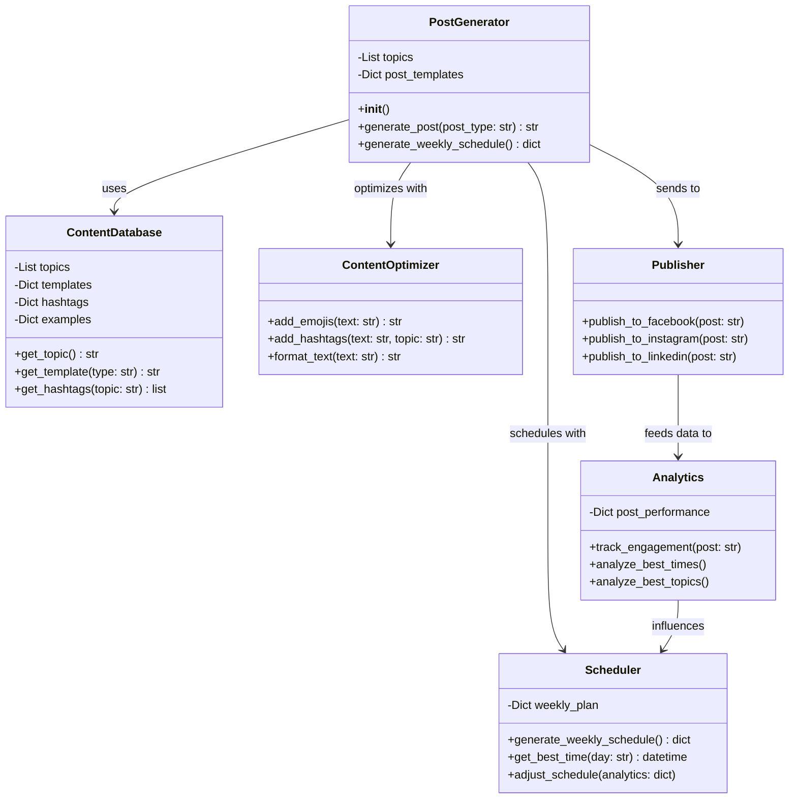

אני אעדכן את הדיאגרמה כך שתשקף את הקוד הקיים ואציע שיפורים והרחבות.




הנה ההמלצות שלי לשיפור והרחבת המערכת הקיימת:

1. **שיפורים למחלקה הקיימת**:
```python
class PostGenerator:
    def __init__(self):
        # הוספת שדות חדשים
        self.hashtags = {
            "אוטומציה": ["#אוטומציהלעסקים", "#חסכוןבזמן", "#פתרונותדיגיטליים"],
            "שיווק דיגיטלי": ["#שיווקדיגיטלי", "#קידוםעסקים", "#שיווקברשת"],
            # ... עוד נושאים
        }
        
        self.emoji_map = {
            "סקר": "📊",
            "טיפ מקצועי": "💡",
            "אתגר": "🏆",
            "דיון": "💭"
        }

    def optimize_post(self, post, topic, post_type):
        # הוספת אימוג'ים רלוונטיים
        post = f"{self.emoji_map.get(post_type, '')} {post}"
        
        # הוספת האשטאגים
        hashtags = ' '.join(self.hashtags.get(topic, []))
        post = f"{post}\n\n{hashtags}"
        
        return post

    def generate_post(self, post_type=None):
        # השאר את הלוגיקה הקיימת
        post = super().generate_post(post_type)
        return self.optimize_post(post, topic, post_type)
```

2. **הוספת מחלקת אנליטיקה**:
```python
class PostAnalytics:
    def __init__(self):
        self.performance_data = {}
    
    def track_post(self, post, engagement):
        # מעקב אחרי ביצועי פוסטים
        self.performance_data[post] = engagement
    
    def get_best_performing_type(self):
        # ניתוח סוג הפוסט המצליח ביותר
        pass
    
    def get_best_topics(self):
        # ניתוח הנושאים המצליחים ביותר
        pass
```

3. **הוספת מחלקת תזמון**:
```python
class PostScheduler:
    def __init__(self, analytics):
        self.analytics = analytics
        self.optimal_times = {
            "ראשון": ["10:00", "15:00", "20:00"],
            "שני": ["9:00", "13:00", "19:00"],
            # ... שאר הימים
        }
    
    def get_optimal_time(self, day):
        return random.choice(self.optimal_times[day])
    
    def generate_schedule(self, posts):
        schedule = {}
        for day, post in posts.items():
            schedule[day] = {
                "post": post,
                "time": self.get_optimal_time(day)
            }
        return schedule
```

4. **שיפור תבניות התוכן**:
```python
ADVANCED_TEMPLATES = {
    "וובינר": [
        "🎥 וובינר בנושא {topic}!\n\nמה נלמד:\n• [נקודה 1]\n• [נקודה 2]\n• [נקודה 3]\n\nמתי? [תאריך ושעה]\nאיפה? [פלטפורמה]\n\nלהרשמה: [קישור]",
    ],
    "מקרה בוחן": [
        "📈 סיפור הצלחה: איך {client_name} שיפר את ה{topic} שלו\n\nאתגר: [תיאור האתגר]\nפתרון: [תיאור הפתרון]\nתוצאות: [תיאור התוצאות]\n\nרוצים תוצאות דומות? פנו אלינו!",
    ]
}
```

5. **תוספות מתקדמות**:
```python
class AIContentEnhancer:
    def enhance_post(self, post):
        # שימוש ב-AI לשיפור הטקסט
        pass
    
    def generate_image_prompt(self, post):
        # יצירת פרומפט ל-DALL-E או Midjourney
        pass

class ContentCalendarManager:
    def __init__(self):
        self.content_calendar = {}
    
    def add_post(self, date, post):
        self.content_calendar[date] = post
    
    def get_weekly_overview(self):
        # החזרת סקירה שבועית של התוכן המתוכנן
        pass
```

האם תרצה שאפרט יותר על אחד מהחלקים? או שנתמקד בפיתוח אחד השיפורים המוצעים?# Automate-post-generator
